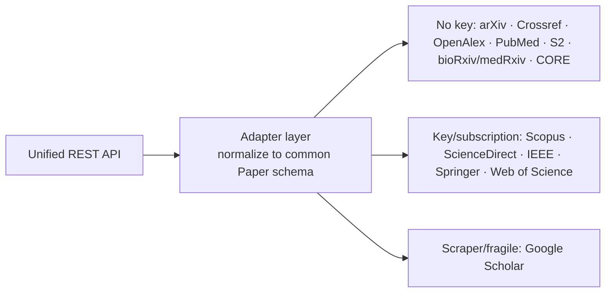

# Academic Database Access — Libraries & APIs Overview

Research notes for implementing a containerized microservice exposing a unified API
for accessing academic databases and search engines.

This is split into two tiers:

- **(A) Single-database clients** — the building blocks you'd embed directly.
- **(B) Multi-database aggregators** — libraries that already unify several sources;
  useful as reference architectures or as drop-in dependencies.

## A. Single-Database Client Libraries

| Library | Database(s) | Key function signatures (name → params : types → return) | Repo / Docs | Last maintained |
|---|---|---|---|---|
| **semanticscholar** (danielnsilva) | Semantic Scholar (Academic Graph, Recommendations, Datasets) — 200M+ papers | `SemanticScholar(timeout:int=30, api_key:str\|None=None, api_url:str\|None=None, debug:bool=False, retry:bool=True)` `search_paper(query:str, ...) → PaginatedResults[Paper]` `get_paper(paper_id:str, fields:list=None) → Paper` `get_papers(paper_ids:list[str]) → list[Paper]` `get_paper_citations(paper_id:str) → PaginatedResults[Citation]` `get_paper_references(paper_id:str) → PaginatedResults[Reference]` `search_author(query:str) → PaginatedResults[Author]` `get_recommended_papers(paper_id:str) → list[Paper]` | [github.com/danielnsilva/semanticscholar](https://github.com/danielnsilva/semanticscholar) · [docs](https://semanticscholar.readthedocs.io) | v0.12.0 (PyPI, active 2026) |
| **habanero** (sckott) | Crossref REST API (DOI metadata, 140M+ records) | `Crossref(base_url='https://api.crossref.org', api_key=None, mailto=None, ua_string=None, timeout=5)` `works(ids:list[str]\|str=None, query:str=None, filter:dict=None, offset:float=None, limit:float=None, sample:float=None, sort:str=None, order:str=None, facet=None, select:list[str]\|str=None, cursor:str=None, cursor_max:float=5000, progress_bar:bool=False, **kwargs) → dict` `members(...)`, `journals(...)`, `funders(...)`, `prefixes(...)`, `types(...)`, `licenses(...)` (same shape) `registration_agency(ids)`, `random_dois(sample:int)` | [github.com/sckott/habanero](https://github.com/sckott/habanero) · [docs](https://habanero.readthedocs.io) | v2.9.2 docs / v2.4.0 PyPI (2026) |
| **arxiv.py** (lukasschwab) | arXiv (physics, math, CS, etc. preprints) | `Client(page_size:int=100, delay_seconds:float=3.0, num_retries:int=3)` `Search(query:str="", id_list:list[str]=[], max_results:int\|None=None, sort_by:SortCriterion=Relevance, sort_order:SortOrder=Descending)` `Client.results(search:Search, offset:int=0) → Iterator[Result]` `Result` exposes `.title`, `.authors`, `.summary`, `.pdf_url`, `.source_url()` | [github.com/lukasschwab/arxiv.py](https://github.com/lukasschwab/arxiv.py) · [docs](https://lukasschwab.me/arxiv.py/) | v4.0.0 (2026-05-17) |
| **Biopython — Bio.Entrez** | PubMed / NCBI Entrez (MEDLINE, PMC, nucleotide, etc.) | `Entrez.esearch(db:str, term:str, **keywds) → handle` (XML; e.g. `retmax`, `retstart`, `idtype`, `sort`) `Entrez.efetch(db:str, id, rettype, retmode, **keywds) → handle` `Entrez.esummary(db, id, **keywds) → handle` `Entrez.elink(dbfrom, db, id, **keywds) → handle` `Entrez.read(handle, validate=True) → dict/list` | [github.com/biopython/biopython](https://github.com/biopython/biopython) · [docs](https://biopython.org/docs/latest/api/Bio.Entrez.html) | v1.87 (active 2026) |
| **pyalex** (J535D165) | OpenAlex (270M+ works, authors, sources, institutions, topics, publishers, funders) | `Works()`, `Authors()`, `Sources()`, `Institutions()`, `Topics()`, `Publishers()`, `Funders()`, `Concepts()` Fluent API: `Works().search(str)`, `.filter(**kwargs)`, `.sort(**kwargs)`, `.group_by(str)`, `.select(list)`, `.sample(n, seed)`, `.get() → list[dict]` `Works()["W..."] → Work` (single entity); `.paginate(per_page, n_max) → iterator` | [github.com/J535D165/pyalex](https://github.com/J535D165/pyalex) | active (2026) |
| **scholarly** (scholarly-python-package) | Google Scholar (unofficial scraper — needs proxies, blockable) | `search_pubs(query:str, patents:bool=True, citations:bool=True, year_low:int=None, year_high:int=None, sort_by:str='relevance', include_last_year:str='abstracts', start_index:int=0) → Iterator[Publication]` `search_author(name:str) → Iterator[Author]` `search_author_id(id:str) → Author` `fill(object) → object`, `citedby(pub) → Iterator[Publication]`, `bibtex(pub) → str` | [github.com/scholarly-python-package/scholarly](https://github.com/scholarly-python-package/scholarly) · [docs](https://scholarly.readthedocs.io) | pushed 2026-03-24; last release v1.7.11 (2023-01-16) |
| **elsapy** (ElsevierDev) | Elsevier: **Scopus** + **ScienceDirect** (requires API key + institutional subscription) | `ElsClient(api_key:str, ...)` `ElsSearch(query:str, index:str)` where index ∈ `scopus`/`scidir`/`author`/`affiliation` `ElsSearch.execute(els_client=None, get_all=False, use_cursor=False, view=None, count=25, fields=[]) → None` (populates `.results:list[dict]`, `.results_df`) `AbsDoc(uri)`, `FullDoc(uri)`, `ElsAuthor`, `ElsAffil` with `.read(client)`, `.readDocs(client)` | [github.com/ElsevierDev/elsapy](https://github.com/ElsevierDev/elsapy) | v0.5.1 (2022-11-09) — semi-dormant |

## B. Multi-Database Aggregator Libraries (unified APIs — reference designs)

These already do what you're building; worth studying or embedding directly.

| Library | Databases covered | Unified function signatures | Repo / Docs | Last maintained |
|---|---|---|---|---|
| **scimesh** (gabfssilva) | arXiv, OpenAlex, Scopus, Semantic Scholar, CrossRef | `async search(query:Query, providers:list[Provider], max_results:int=100) → Result` (Result.papers) Query DSL: `title(str)`, `author(str)`, `year(lo,hi)`, `fulltext(str)` composed with `& \| ~` Providers: `Arxiv()`, `OpenAlex(mailto=)`, `Scopus()`, `SemanticScholar()`, `CrossRef(mailto=, auto_download=)` Provider methods: `.search(query)`, `.get(doi)`, `.citations(id, direction)` | [github.com/gabfssilva/scimesh](https://github.com/gabfssilva/scimesh) | v0.3.0 (2026-03-28) |
| **scitex-scholar** (ywatanabe1989) | CrossRef, OpenAlex, Semantic Scholar, arXiv, PubMed (+ DOI resolution, PDF download, BibTeX enrichment) | `Scholar()` → `.search(query:str, year_min:int=None, ...) → Papers` `Papers.save(path)`, `apply_filters(papers, min_citations=, min_impact_factor=)` `to_bibtex(papers) → str`, `to_ris(...)`, `to_endnote(...)` | [github.com/ywatanabe1989/scitex-scholar](https://github.com/ywatanabe1989/scitex-scholar) | v1.7.1 (2026-07-13) — very active |
| **academic-mcp** (MCP server) | 18–19 sources: arXiv, PubMed, PMC, bioRxiv, medRxiv, Google Scholar, IACR, Semantic Scholar, CrossRef, CORE, IEEE, Scopus, Springer, ScienceDirect, Web of Science, ACM, JSTOR | `paper_search(queries:list[{searcher, query, max_results, year}]) → list[Paper]` `paper_download(items:list[{searcher, paper_id}]) → list[path]` `paper_read(searcher:str, paper_id:str) → str` Standardized `Paper` dict output; async (httpx) | [pypi.org/project/academic-mcp](https://pypi.org/project/academic-mcp/) | v0.1.7 (2026-01-26) |
| **ai4scholar-mcp** | arXiv, PubMed, Semantic Scholar, bioRxiv, medRxiv, Google Scholar | Per-source tools e.g. `search_arxiv`, `search_pubmed`, `get_pubmed_citations`, `search_semantic`, `get_semantic_references`, `download_pdf_by_doi` | [pypi.org/project/ai4scholar-mcp](https://pypi.org/project/ai4scholar-mcp/) | v0.4.0 (2026-03-22) |
| **academic-search** (MCP) | Semantic Scholar, Crossref, OpenAlex, PubMed | `search_papers(query, provider, limit, year_min, year_max, min_citation_count, open_access_only, journal, author, ...)` `search_by_author(...)`, `explore_citations(seed_paper_id, num_steps, direction_choice, bias, ...)`, `get_paper_stats(...)` — normalized schema across providers | [pypi.org/project/academic-search](https://pypi.org/project/academic-search/) | v0.7.2 (2026-05-22) |
| **scholarx** | arXiv, PMC, bioRxiv, medRxiv, PsyArXiv, OSF, Semantic Scholar | Action-routed MCP/agent tools: `search.author/get/recent`, `discovery.categories`, `storage.download/bulk_download/queue/status` | [pypi.org/project/scholarx](https://pypi.org/project/scholarx/) | v0.25.0 (2026-06-06) |
| **research_finder** (Tushar-Siddik) | Semantic Scholar, arXiv, PubMed, CrossRef, OpenAlex, Google Scholar | `base_searcher`-derived classes per source + `aggregator.py` coordinator; exports CSV/JSON/BibTeX/RIS/Excel | [github.com/Tushar-Siddik/research_finder](https://github.com/Tushar-Siddik/research_finder) | active 2026 |

## Coverage & design notes for the microservice

Key considerations when embedding these:

- **Free, no-auth, high-coverage core** — Prioritize **OpenAlex (pyalex)**, **Crossref
  (habanero)**, **arXiv (arxiv.py)**, **PubMed (Bio.Entrez)**, and **Semantic Scholar
  (semanticscholar)**. Together they cover the vast majority of scholarly literature
  with permissive terms. This is exactly the set that `scimesh` and `scitex-scholar`
  federate.
- **Rate limits / "polite pool"** — Crossref & OpenAlex reward a `mailto`; Semantic
  Scholar and PubMed/NCBI give higher limits with an API key. Bake per-provider rate
  limiting and key config into the adapter layer.
- **Paywalled/commercial** — **Scopus & ScienceDirect (elsapy)**, IEEE, Springer, Web
  of Science require API keys *and* institutional subscriptions; `elsapy` is
  officially maintained by Elsevier but is stale (2022) and alpha. Treat these as
  optional plugins.
- **Google Scholar** — No official API; `scholarly` scrapes and gets IP-blocked
  without proxies. Include only with strong caveats.
- **Schema normalization** — Every aggregator above converges on a common `Paper`
  object (title, authors, year, DOI, abstract, citation count, URLs). Adopt one
  canonical schema and write thin per-source adapters — the `academic-mcp` `Paper`
  class and `scimesh`'s deduplication-by-DOI approach are good models.
- **Async I/O** — `semanticscholar`, `scimesh`, and `academic-mcp` all use async; for
  a containerized service fanning out to many providers concurrently, an
  async httpx-based adapter layer will scale best.
