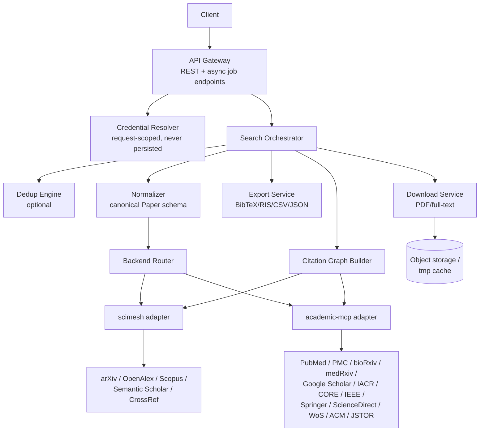

# Unified Academic Search API — Implementation Plan

Implementation plan for a containerized microservice that exposes a single unified
REST/async API on top of two underlying libraries:

- **scimesh** — typed, async, provider-composable search DSL (arXiv, OpenAlex, Scopus,
  Semantic Scholar, CrossRef) with built-in `.citations(id, direction)` support.
- **academic-mcp** — broad coverage (18–19 sources incl. PubMed, PMC, bioRxiv, medRxiv,
  Google Scholar, IACR, CORE, IEEE, Springer, ScienceDirect, Web of Science, ACM,
  JSTOR) with `paper_search`, `paper_download`, `paper_read` MCP tools.

The service treats both libraries as **backends behind a common adapter interface**,
so callers never need to know which library actually served a given provider.

Reference: `academic-database-libraries-overview.md` in this directory.

---

## 1. Goals & Non-Goals

**Goals**

1. Search across multiple providers (spanning both scimesh and academic-mcp) in a
   single call, with per-provider results merged into one canonical schema.
2. Accept per-request or per-provider credentials (API keys, institutional tokens,
   `mailto`) and forward them to the correct backend without persisting them.
3. Export result sets in multiple formats: BibTeX, RIS, CSV, JSON (and optionally
   EndNote/XML), matching the shape of `scitex-scholar`'s exporters.
4. Full text / PDF retrieval, proxied through `academic-mcp.paper_download` /
   `paper_read` and scimesh's `auto_download` where available, with a uniform
   download endpoint and storage/streaming strategy.
5. Build citation graphs from a set of seed papers, expanding both **forward**
   (cited-by) and **backward** (references) edges, bounded by a configurable
   **depth limit** and per-level fan-out cap.
6. Optional automatic deduplication of search results (cross-provider), exposing a
   dedup report (counts, merged clusters, match strategy per cluster) alongside the
   deduplicated list.

**Non-Goals**

- Not re-implementing scraping resilience for Google Scholar beyond what `scholarly`
  (via academic-mcp) already provides — expose it as a best-effort, opt-in provider.
- Not building a persistent research-graph database (e.g. Neo4j) in v1 — citation
  graphs are computed on demand and returned as a graph payload; persistence is a
  later phase (see §9).
- Not implementing OAuth/institutional SSO flows — credentials are supplied as
  opaque secrets (API keys/tokens) per request or via service-level config.

---

## 2. High-Level Architecture



Core components:

| Component | Responsibility |
|---|---|
| **API Gateway** | HTTP surface, request validation, auth passthrough, job orchestration for long-running operations (graph building, bulk export/download). |
| **Credential Resolver** | Extracts per-provider credentials from the request (or falls back to service defaults), validates required-ness per provider, injects into backend adapter calls. Never logs or stores secrets. |
| **Backend Router** | Maps each requested `provider` name to the backend (scimesh vs academic-mcp) that serves it, per the coverage table in §3. |
| **scimesh adapter** | Wraps `scimesh.search`, `Provider.get`, `Provider.citations` behind the internal adapter interface. |
| **academic-mcp adapter** | Wraps `paper_search`, `paper_download`, `paper_read` MCP tool calls (invoked as a library/subprocess/MCP client) behind the same interface. |
| **Normalizer** | Converts each backend's native result into the canonical `Paper` schema (§4). |
| **Dedup Engine** | Optional post-processing stage; clusters normalized papers and reports statistics (§6). |
| **Citation Graph Builder** | BFS/DFS expansion over citation edges using backend `.citations()` / citation-lookup tools, with depth + fan-out limits (§7). |
| **Export Service** | Serializes a `Paper[]` (or graph) into BibTeX/RIS/CSV/JSON/EndNote (§5). |
| **Download Service** | Resolves and streams/stores full text or PDFs (§8). |

---

## 3. Provider Coverage & Backend Routing

| Provider | Backend | Auth required | Notes |
|---|---|---|---|
| arXiv | scimesh (primary) / academic-mcp (fallback) | No | Prefer scimesh's typed `Arxiv()` provider. |
| OpenAlex | scimesh | Optional (`mailto` for polite pool) | |
| CrossRef | scimesh | Optional (`mailto`) | scimesh's `auto_download` flag toggles PDF fetch. |
| Semantic Scholar | scimesh | Optional (API key, higher limits) | |
| Scopus | scimesh | **Required** (API key + institutional access) | |
| PubMed / PMC | academic-mcp | No (NCBI API key optional, raises limits) | |
| bioRxiv / medRxiv | academic-mcp | No | |
| Google Scholar | academic-mcp | No (unofficial, scrape-based) | Opt-in only; documented as fragile/blockable. |
| IACR | academic-mcp | No | |
| CORE | academic-mcp | Optional (API key) | |
| IEEE | academic-mcp | **Required** | |
| Springer | academic-mcp | **Required** | |
| ScienceDirect | academic-mcp | **Required** | |
| Web of Science | academic-mcp | **Required** | |
| ACM / JSTOR | academic-mcp | **Required** | |

The router is a static provider → backend map plus a per-provider `credential_spec`
(`required: bool`, `fields: [...]`) used by the Credential Resolver for validation.
Where a provider is nominally available in both backends (e.g. arXiv), config picks a
preferred backend but allows override (`?backend=academic-mcp`) for debugging/fallback.

---

## 4. Canonical `Paper` Schema

Adopt one normalized schema all adapters map into, modeled on `academic-mcp.Paper`
and scimesh's `Result.papers`:

```jsonc
{
  "id": "sha256:<hash of best-available identifier>",   // stable internal id
  "doi": "10.xxxx/yyyy",                                  // nullable
  "external_ids": { "arxiv": "2401.0001", "s2": "abcd", "pmid": "123456" },
  "provider": "openalex",
  "backend": "scimesh",
  "title": "…",
  "abstract": "…",
  "authors": [{ "name": "…", "affiliations": ["…"], "orcid": null }],
  "year": 2026,
  "venue": "…",
  "citation_count": 42,
  "reference_count": 30,
  "open_access": true,
  "pdf_url": "https://…",
  "landing_page_url": "https://…",
  "urls": ["https://…"],
  "raw": { /* original provider payload, kept for audit/debug */ }
}
```

- `id` is computed by the Normalizer using an identifier-priority chain
  (DOI → arXiv ID → PMID → Semantic Scholar ID → title+year hash) — this same chain
  is reused by the Dedup Engine (§6) as its strongest signal.
- `raw` is retained (not returned by default; opt in via `?include_raw=true`) to avoid
  losing provider-specific fields needed for export (e.g. BibTeX `note`/`series`).

---

## 5. Search API & Export Formats

### 5.1 `POST /v1/search`

```jsonc
{
  "query": { "text": "graph neural networks", "author": "…", "year": {"gte": 2022} },
  "providers": ["openalex", "arxiv", "pubmed", "scopus"],
  "max_results": 100,
  "per_provider_max": 50,
  "credentials": {
    "scopus": { "api_key": "…" },
    "openalex": { "mailto": "team@example.org" },
    "core": { "api_key": "…" }
  },
  "dedup": { "enabled": true, "strategy": "auto" },
  "include_raw": false
}
```

Response:

```jsonc
{
  "papers": [ /* canonical Paper[] */ ],
  "per_provider": { "openalex": { "count": 40, "errors": [] }, "scopus": { "count": 0, "errors": ["missing_credentials"] } },
  "dedup_report": { /* see §6, present only if dedup.enabled */ },
  "took_ms": 812
}
```

- Query DSL mirrors scimesh's composable DSL (`title()`, `author()`, `year(lo,hi)`,
  `fulltext()`, combined with `& | ~`) but is exposed as a structured JSON object so
  academic-mcp's flatter `paper_search(queries=[...])` shape can be derived from it
  (one derived sub-query per provider that doesn't support the full DSL).
- Fan-out is parallel (`asyncio.gather`) across providers with per-provider timeout
  and isolated error handling — one provider failing/missing credentials must not
  fail the whole request (see `per_provider.errors`).

### 5.2 Export: `POST /v1/export`

```jsonc
{ "paper_ids": ["…", "…"], "format": "bibtex" }   // or: "papers": [ ...inline canonical Paper[] ]
```

| Format | Notes |
|---|---|
| `bibtex` | Adapted from `scitex-scholar.to_bibtex`; entry type inferred from `venue`/`raw` (article/inproceedings/misc). |
| `ris` | Adapted from `scitex-scholar.to_ris`. |
| `csv` | Flat, one row per paper; authors joined with `;`. |
| `json` | Canonical schema, pretty-printed; supports `include_raw`. |
| `endnote` | Optional, reuses `to_endnote` pattern; stretch goal. |

Export is stateless and format-pluggable (`ExportFormat` interface with
`serialize(papers: Paper[]) -> bytes`), so adding a format later is a single new
class + registry entry.

---

## 6. Deduplication Engine

Deduplication is **opt-in** per request (`dedup.enabled`) and runs after
normalization, before the response is returned (or before graph building, if
requested there too).

### 6.1 Matching strategy (tiered, in priority order)

1. **Exact identifier match** — DOI, arXiv ID, PMID, Semantic Scholar ID (case/format
   normalized). This mirrors scimesh's "dedup-by-DOI" approach mentioned in the
   overview, generalized to any strong external ID.
2. **Fuzzy title+year match** — normalized title (lowercased, punctuation/stopwords
   stripped) + same year (±0), similarity via token-set ratio ≥ configurable
   threshold (default 0.92), plus author-surname-overlap check to reduce false
   positives.
3. **Fuzzy title-only fallback** — same as above without year constraint, higher
   threshold (default 0.97), used only when `strategy: "aggressive"` is requested.

Default `strategy: "auto"` runs tiers 1–2; `"strict"` runs only tier 1; `"aggressive"`
runs all three.

### 6.2 Merge policy

When papers cluster together, a single "canonical" representative is chosen and the
rest are folded in as `merged_from`:

- Prefer the record with the most complete metadata (abstract present, DOI present,
  full author list) as base.
- Union `external_ids` and `urls` across cluster members.
- `citation_count`/`reference_count` take the max observed value (different providers
  under-count).
- Field-level provenance retained: `field_sources: { "abstract": "openalex", ... }`
  for auditability.

### 6.3 Dedup report

Returned alongside results when enabled:

```jsonc
{
  "input_count": 210,
  "output_count": 148,
  "duplicates_removed": 62,
  "clusters": [
    {
      "canonical_id": "sha256:…",
      "match_tier": "exact_doi",
      "members": [
        { "id": "sha256:…", "provider": "openalex" },
        { "id": "sha256:…", "provider": "crossref" }
      ]
    }
  ],
  "by_tier": { "exact_doi": 40, "exact_arxiv": 5, "fuzzy_title_year": 17 },
  "by_provider_pair": { "openalex+crossref": 30, "arxiv+semanticscholar": 12 }
}
```

This gives callers both aggregate statistics (`by_tier`, `by_provider_pair`) and full
traceability (`clusters`) without requiring a second API call.

---

## 7. Citation Graph Builder

### 7.1 `POST /v1/graph`

```jsonc
{
  "seeds": ["10.xxxx/yyyy", "arxiv:2401.0001"],
  "direction": "both",           // "citing" | "cited_by" | "both"
  "max_depth": 2,
  "max_nodes_per_level": 100,
  "max_total_nodes": 2000,
  "dedup": { "enabled": true },
  "credentials": { "scopus": { "api_key": "…" } }
}
```

- **Direction semantics**: `cited_by` = forward edges (papers that cite the seed),
  `citing` = backward edges (papers the seed cites / its references), `both` expands
  in both directions independently, tagging each edge accordingly.
- **Backend calls**: scimesh's `Provider.citations(id, direction)` is the primary
  mechanism for its providers; for academic-mcp-backed providers, citation lookups go
  through whatever citation/reference tool each source's academic-mcp searcher
  exposes (e.g. Semantic Scholar-style `get_paper_citations` /
  `get_paper_references` if available) — providers without citation support are
  skipped and reported per node.
- **Depth limiter**: BFS from seeds. `max_depth` bounds hop count from any seed.
  `max_nodes_per_level` caps breadth per BFS level (prevents hub-paper explosion);
  `max_total_nodes` is a hard global cap that aborts expansion early once reached,
  returning a `truncated: true` flag.
- **Cross-provider node identity**: reuses the Normalizer's identifier-priority
  chain, so a paper discovered via two different providers/directions collapses to
  one graph node (dedup is effectively mandatory at the node level; the optional
  `dedup.enabled` flag additionally controls whether the *tiered fuzzy* matching from
  §6 is applied to graph nodes, beyond the always-on exact-ID collapsing).
- **Cycle/revisit handling**: a `visited` set keyed by canonical `id` prevents
  re-expanding the same node twice; edges are still recorded on revisit (so cycles are
  represented) but expansion does not recurse further.

### 7.2 Response shape

```jsonc
{
  "nodes": [ /* canonical Paper[] with extra `depth`, `is_seed` fields */ ],
  "edges": [ { "from": "sha256:…", "to": "sha256:…", "type": "cites" } ],
  "truncated": false,
  "stats": { "nodes_by_depth": {"0": 3, "1": 84, "2": 640}, "skipped_no_citation_support": ["iacr"] }
}
```

Graph building is expected to be slow for `max_depth ≥ 2`; expose it as an async job
(`POST /v1/graph` returns `202 { job_id }`, poll `GET /v1/jobs/{id}`) rather than a
synchronous call, reusing the same job infrastructure as bulk export/download (§8).

---

## 8. Full Text / PDF Downloads

### 8.1 `POST /v1/download`

```jsonc
{ "paper_ids": ["…", "…"], "prefer": "pdf", "credentials": { "ieee": { "api_key": "…" } } }
```

- Delegates to `academic-mcp.paper_download(items=[{searcher, paper_id}, ...])` for
  providers routed there, and to scimesh's `auto_download`/`Provider.get` +
  `pdf_url` resolution for scimesh-routed providers.
- For text-extraction use cases (not raw PDF), also expose `paper_read` via
  `GET /v1/papers/{id}/fulltext` returning extracted plain text where the backend
  supports it (academic-mcp `paper_read`).
- Results are streamed through the Download Service into a short-lived object store
  (local disk volume or S3-compatible bucket) and returned as signed URLs / or
  streamed directly for single-file requests; bulk requests return a job with
  per-item status (`ok`, `paywalled`, `not_found`, `error`).
- Respect and surface licensing/open-access flags (`open_access` field) so callers can
  distinguish "no legal full text available" from "download failed".

---

## 9. Credential Handling

- Credentials travel in the request body under `credentials.<provider>` (see §5.1)
  and/or a service-level `.env`/secret-store default per provider (used only when the
  caller omits a provider's credentials and the provider allows anonymous/limited
  access, e.g. CrossRef without `mailto`).
- The Credential Resolver:
  1. Validates presence of required fields per provider (`credential_spec` from §3);
     missing-but-required → that provider is skipped with `errors: ["missing_credentials"]`
     rather than failing the whole request.
  2. Passes credentials straight into the corresponding scimesh `Provider(...)`
     constructor kwargs or academic-mcp searcher config — never written to logs,
     never persisted to disk/db, scoped to the lifetime of the single request/job.
  3. Supports per-request override of service defaults (e.g. a caller's own Scopus
     key instead of the service's).
- Downloadable/streamed job credentials (long-running graph/download jobs) are held
  in-memory for the job's duration only and discarded on completion/failure.

---

## 10. Non-Functional Concerns

- **Async fan-out**: all backend calls are async (httpx-based, matching both
  scimesh and academic-mcp's own async design) with per-provider timeout + retry with
  backoff, and circuit-breaking for providers that repeatedly fail (e.g. Google
  Scholar rate-limits).
- **Rate limiting**: per-provider token buckets, configurable, with `mailto`/API-key
  presence increasing bucket size automatically (per §3 notes).
- **Caching**: short-TTL cache (per provider+query hash) to absorb repeated searches
  and reduce load on paywalled/rate-limited providers; explicit `no_cache` override.
- **Observability**: structured logs per request with provider timings/error codes
  (never logging credential values); metrics for dedup effectiveness and graph size
  over time.
- **Extensibility**: adding a new provider = (a) register it with a backend adapter,
  (b) add a `credential_spec` entry, (c) add a Normalizer mapping. No changes needed
  to Search/Export/Dedup/Graph logic.

---

## 11. Phased Delivery Plan

1. **Phase 1 — Core search + normalization**
   Backend adapters for scimesh + academic-mcp, canonical `Paper` schema, `/v1/search`
   with credential passthrough and per-provider error isolation. No dedup, no export
   beyond JSON.
2. **Phase 2 — Export formats**
   BibTeX, RIS, CSV exporters (+ EndNote stretch) via `/v1/export`.
3. **Phase 3 — Deduplication**
   Tiered matching engine, merge policy, dedup report; wire `dedup.enabled` into
   `/v1/search`.
4. **Phase 4 — Downloads**
   `/v1/download` + `/v1/papers/{id}/fulltext`, object storage integration, job status
   tracking for bulk requests.
5. **Phase 5 — Citation graphs**
   BFS graph builder with depth/fan-out limits, async job infrastructure
   (`/v1/graph`, `/v1/jobs/{id}`), dedup-aware node collapsing.
6. **Phase 6 — Hardening**
   Rate limiting, caching, circuit breakers, metrics/observability, provider
   coverage expansion (IEEE/Springer/WoS/ACM/JSTOR credential-gated plugins).

---

## 12. Open Questions

- Should academic-mcp be invoked in-process as a Python library, or via its MCP
  server protocol (stdio/HTTP)? In-process avoids protocol overhead but couples
  versions tightly; MCP-protocol invocation isolates it as a swappable service.
- Do we need per-tenant credential storage (multi-tenant SaaS) vs. purely
  per-request credentials (current plan assumes the latter)?
- What's the acceptable latency budget for `max_depth=2+` citation graphs — does
  Phase 5 need a persistent graph cache/store (e.g. Neo4j/Redis) sooner than planned?
